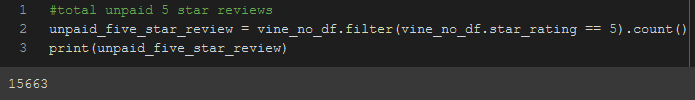

# Amazon Vine Program Analysis on Video Games Reviews

## Overview of the analysis

We are analyzing reviews for video games on Amazon and comparing for any influence from the paid vine program for written reviews. As the review dataset is really large, we will be using Amazon's RDS for storing the database and accessing it via PostgreSQL. All the ETL process is done using PySpark, a python library for big data and machine learning. The total review dataset can be found <a href='https://s3.amazonaws.com/amazon-reviews-pds/tsv/amazon_reviews_us_Video_Games_v1_00.tsv.gz'>here.</a>  

## Results

As the dataset was really large, we simplified the dataset by taking only those games where <B>total votes</B> were 20 or more. After that, we only took those reviews where there were helpful votes of 50% or more of the total votes. This helped in taking games with more relevant votes. After that, we tried to answer the following questions:

- <b>Number of reviews:</B> There were only 94 reviews that were paid versus around 40 thousand unpaid reviews

</img>
</img>

- <b>Number of 5 star reviews:</B> The total number of 5 star reviews for the vine program was 48, whereas unpaid 5 stars were around 15 thousands

</img>
</img> 

- <b>Percentage of 5 star reviews:</B> The total percentage of 5 star reviews for the vine program was almost 51% and for the non-vine set it was only 39%   

</img>
</img> 

## Summary

Considering the results of the analysis, it can be easily said that there is a certain positivity bias in the vine program. Even with a small number of reviews coming from the vine program, there is a 51% positivity rate, whereas the unpaid reviews were only 39% positive. 

One additional analysis that we can do that can further assist in this decision can be a one-tailed T.test for the vine vs non-vine dataset, without excluding / filtering out any reviews. This will show whether our vine mean is statistically significant to the overall mean or not.